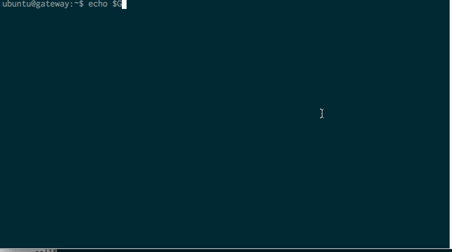

# kcptun
TCP流转换为KCP+UDP流(AES加密)，核心基于[kcp-go](https://github.com/xtaci/kcp-go)，用于在高丢包环境中，TCP降速严重的问题，工作示意图:      
```

                 +---------------------------------------+
                 |                                       |
                 |                KCPTUN                 |
                 |                                       |
 +--------+      |  +------------+       +------------+  |      +--------+
 |        |      |  |            |       |            |  |      |        |
 | Client | +--> |  | KCP Client | +---> | KCP Server |  | +--> | Server |
 |        |      |  |            |       |            |  |      |        |
 +--------+      |  +------------+       +------------+  |      +--------+
                 |                                       |
                 |                                       |
                 +---------------------------------------+

```

kcptun的用途是: ***远程端口转发***

kcptun客户端和服务端分别只有一个main.go文件，非常简单，也方便自己修改。      

# 安装前的准备
注意，请确保默认服务器端UDP端口 ```29900``` 开启，防火墙允许UDP包通过。   (端口可以通过命令行参数调整，不要忘记修改对应的防火墙规则。)

# 基于二进制的安装 (使用简单)
在release中下载对应平台的版本， 执行 client -h 和server -h 查看详细使用方法.        
我们以加速ssh -D访问为例示范使用方法如下：         

1. 假定服务器IP为:```xxx.xxx.xxx.xxx```

2. 在服务器端开启ssh -D     (监听127.0.0.1:8080端口)
```ssh -D 127.0.0.1:8080 ubuntu@localhost```   

3. 在服务器启动kcp server:     
```server -t "127.0.0.1:8080"  ```     // 所有数据包转发到sshd进程的socks 8080端口           

 ----------------------------  分割线，上面是服务器，下面是客户端  ----------------------------  
4. 在本地启动kcp client:          
```client -r "xxx.xxx.xxx.xxx:29900"   ```    // 连接到kcp server，默认kcp server端口是29900           

5. 浏览器就可以连接12948端口进行socks5代理访问了。   // 默认kcp client的端口是12948

```注意：这个例子是为了让你快速上手，正确的姿势应该是是在客户端开启ssh -D，详见 使用案例```

# 基于源码的安装  (方便使用最新版本)
## 预备条件:       
1. 安装好```golang```       
2. 设置好```GOPATH```  以及```PATH=$PATH:$GOPATH/bin``` (例如: ```export GOPATH=/home/ubuntu;  export PATH=$PATH:$GOPATH/bin```), 最好放到.bashrc 或 .zshrc中 

## 安装命令
1. 服务端: ```go get github.com/xtaci/kcptun/server;  server```        
      

2. 客户端: ```go get github.com/xtaci/kcptun/client;  client```      
    


# 使用案例
1. openvpn client -> kcptun client -> kcptun server -> openvpn server (最佳实践)
2. ssh tunnel client -> kcptun client -> kcptun server -> sshd (推荐应用)
3. browser socks5 -> kcptun client -> kcptun server -> ssh -D socks5 server (简易)

# 常见问题
Q: client/server都启动了，但无法传输数据，服务器显示了stream open        
A: 先杀掉client/server，然后重新启动就能解决绝大部分的问题             

Q: client/server都启动了，但服务器没有收到任何数据包也没有stream open          
A: 某些IDC默认屏蔽了UDP协议，需要在防火墙中打开对应的端口

Q: 出现不明原因降速严重，可能有50%丢包         
A: 可能该端口被运营商限制，更换一个端口就能解决

另外，一些比较有代表性的issue可以参考:         
https://github.com/xtaci/kcptun/issues/2

# 参数调整
初步运行成功后，建议通过命令行改变如下参数加强传输安全:         
1. 默认端口        
2. 默认密码         
例如:       
```server -l ":41111" -key "hahahah"```       

# 贡献
欢迎短小精干的PR
